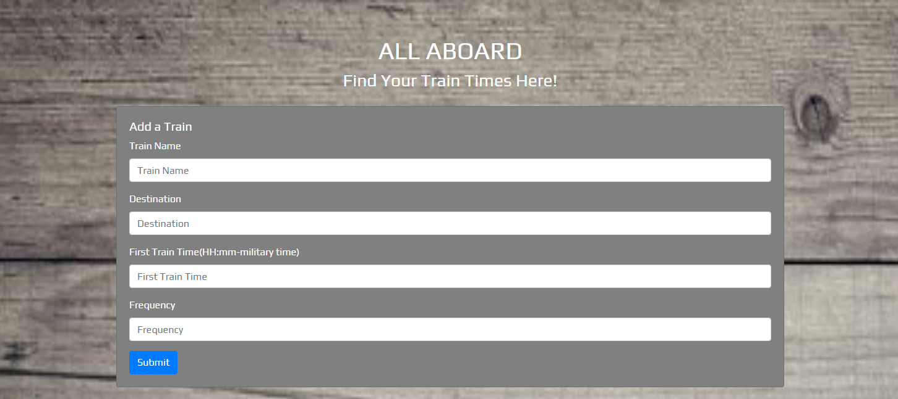
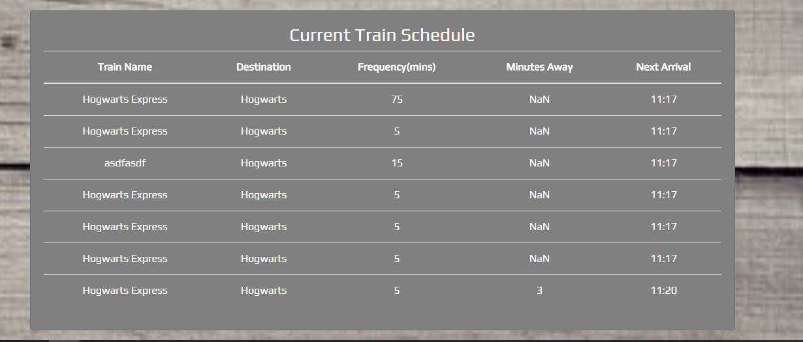

# **Train-Station**
A simple app that allows user to enter train information and get real time data about arrivals.  

## **Overview**
This is an app that allows users to enter train data and get real time data about train arrivals and how many minutes away the trains are. The user will enter the information in the appropriate fields and hit the submit button.  The information will be pushed to a firebase database.  The information will populate on the screen and show in real time the arrival of the next train and how far away the train is in the station.
## **Link To App**
https://blnicholson.github.io/Train-Scheduler

## **Technical Information**
This app was created by using the following:

* JavaScript
* HTML
* CSS
* Firebase 
* jQuery

